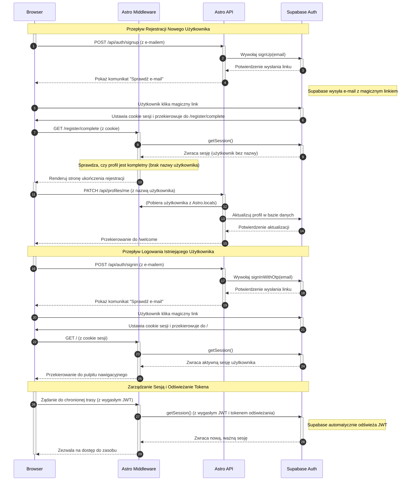

<authentication_analysis>
### 1. Authentication Flows

- **Registration Flow (New User)**:
    - User provides an email address.
    - System sends a magic link.
    - User clicks the link, gets authenticated, and is redirected to a page to set a username.
    - User sets a unique username to complete registration.
    - User is redirected to an onboarding page.
- **Login Flow (Existing User)**:
    - User provides their registered email address.
    - System sends a magic link.
    - User clicks the link, gets authenticated, and is redirected to their dashboard.
- **Session Management & Token Refresh**:
    - On every request, the middleware validates the session using the JWT from cookies.
    - If the token is expired but a valid refresh token exists, Supabase Auth issues a new JWT.
    - The middleware stores user and session info in `Astro.locals`.
- **Protected Routes**:
    - The middleware checks for a valid session on protected routes.
    - Unauthenticated users are redirected to the login page.
- **Profile Completion Check**:
    - The middleware verifies if a newly authenticated user has set their username.
    - If the username is not set, the user is redirected to the `/register/complete` page.

### 2. Actors and Interactions

- **Browser (Użytkownik)**: The user's web browser, where the React UI components are rendered and user interactions happen.
- **Astro Middleware**: Server-side code that intercepts every request to manage sessions, protect routes, and handle redirects.
- **Astro API**: Server-side API endpoints that handle business logic, such as initiating sign-in/sign-up or updating user profiles.
- **Supabase Auth**: The external authentication service that handles sending magic links, verifying users, and issuing JWTs.

### 3. Token Verification and Refresh Process

- **Verification**: On each request to the Astro application, the middleware receives the request cookies, which contain the Supabase JWT. It uses `supabase.auth.getSession()` to verify the token's validity.
- **Refresh**: The Supabase client library automatically handles token refreshing. When the access token (JWT) expires, the library uses the long-lived refresh token (stored securely in a cookie) to request a new access token from Supabase Auth without requiring user interaction. This process is seamless to the user.

### 4. Description of Authentication Steps

1.  **Initiation**: The user enters their email in a form (Login or Register) in the **Browser**.
2.  **API Request**: The browser sends a POST request to the **Astro API** (`/api/auth/signin` or `/api/auth/signup`).
3.  **Auth Service Call**: The **Astro API** calls the appropriate function in **Supabase Auth** to send a magic link.
4.  **Magic Link**: **Supabase Auth** sends an email containing a unique, time-sensitive link to the user.
5.  **Verification Click**: The user clicks the link. This request goes directly to **Supabase Auth**.
6.  **Redirection**: **Supabase Auth** verifies the token in the link, sets session cookies in the user's browser, and redirects the user back to the application (either `/` for login or `/register/complete` for registration).
7.  **Middleware Interception**: The **Astro Middleware** intercepts this redirect request. It uses the cookies to get the session from **Supabase Auth**.
8.  **Session Hydration**: The middleware fetches the user's profile, stores session and user data in `Astro.locals`, and determines the next step (e.g., redirect to dashboard, force profile completion).
9.  **Access**: The user is now authenticated and can access protected routes. For subsequent requests, the middleware will continuously validate their session.

</authentication_analysis>

<mermaid_diagram>

</mermaid_diagram>
